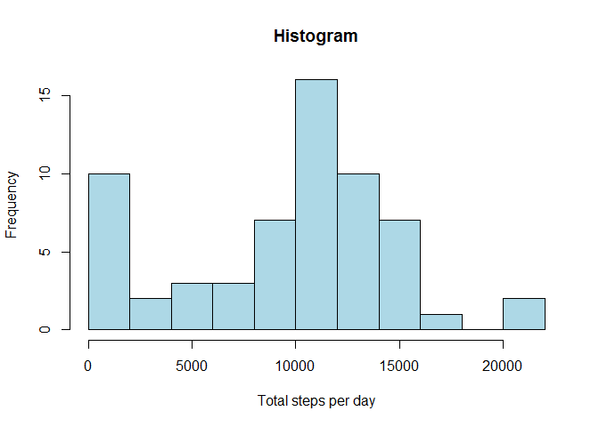
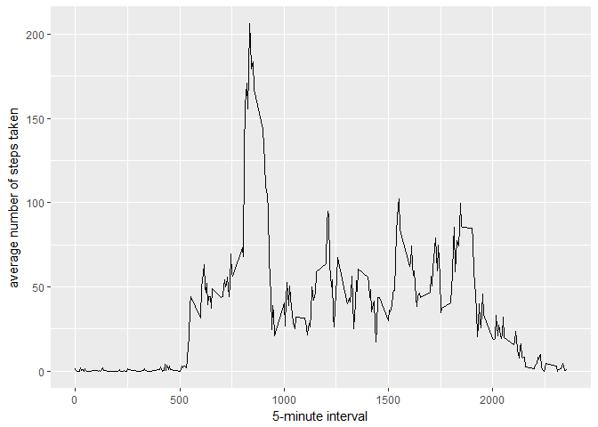
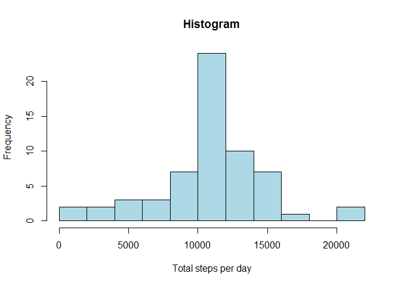
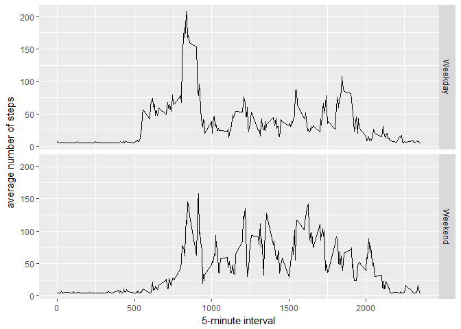

Reproducible Research - Course Project 1
=========================


#Reading Data table


```r
library(data.table)
```

```
## Warning: package 'data.table' was built under R version 3.3.2
```

```r
DT<-read.csv("./activity.csv")
```

####Sumarizing Steps per day

```r
daylySteps <- tapply(DT$steps, DT$date, sum, na.rm=TRUE)
```

####histogram of the total number of steps taken each day

```r
hist(daylySteps, xlab='Total steps per day', ylab='Frequency',breaks = 12,col = "lightblue",main = "Histogram")
```

<!-- -->


####Mean and median number of steps taken each day

```r
MeanDaylySteps <- mean(daylySteps)
MedianDaylySteps <- median(daylySteps)
```
* Mean: 9354.2295082
* Median:  10395


####Time series plot of the average number of steps taken

```r
library(ggplot2)
```

```
## Warning: package 'ggplot2' was built under R version 3.3.3
```

```r
average <- aggregate(x = list(steps = DT$steps), by = list(interval = DT$interval), 
    FUN = mean, na.rm = TRUE)
ggplot(data = average, aes(x = interval, y = steps)) + geom_line() + xlab("5-minute interval") + 
    ylab("average number of steps taken")
```

<!-- -->

####The 5-minute interval that, on average, contains the maximum number of steps

```r
maximunSteps <- average[which.max(average$steps), ]
```
* Interval with Maximum number of steps:  835

###Code to describe and show a strategy for imputing missing data


#####Create a dataset with the missing value filled with the mean using impute funcion in column steps

```r
library(Hmisc)
```

```
## Warning: package 'Hmisc' was built under R version 3.3.3
```

```
## Warning: package 'lattice' was built under R version 3.3.3
```

```
## Warning: package 'survival' was built under R version 3.3.3
```

```
## Warning: package 'Formula' was built under R version 3.3.2
```

```r
DTImputed <- DT
DTImputed$steps <- impute(DT$steps, fun=mean)

steps <- tapply(DTImputed$steps, DTImputed$date, FUN = sum)
stepsByDayMean <- format(mean( steps), digits=2, nsmall=2) 
stepsByDayMedian <- format(median( steps), digits=2, nsmall=2) 
```


#####  Histogram of the total number of steps taken each day after missing values are imputed

```r
stepsperday <- tapply(DTImputed$steps, DTImputed$date, sum)
hist(stepsperday, xlab='Total steps per day', ylab='Frequency',breaks = 12,col = "lightblue",main = "Histogram")
```

<!-- -->

##### Panel plot comparing the average number of steps taken per 5-minute interval across weekdays and weekends
###### create a factor variable using ifelse function to discover wich dates are weekdays or weekend

```r
DTImputed$FormatDate <-as.Date(DTImputed$date)
DTImputed$dateType <-  ifelse(as.POSIXlt(DTImputed$FormatDate)$wday %in% c(0,6), 'Weekend', 'Weekday')


averages <- aggregate(steps ~ interval + dateType, data = DTImputed, mean)
ggplot(averages, aes(interval, steps)) + 
    geom_line() + 
    facet_grid(dateType ~ .) +
    xlab("5-minute interval") + 
    ylab("average number of steps")
```

<!-- -->


